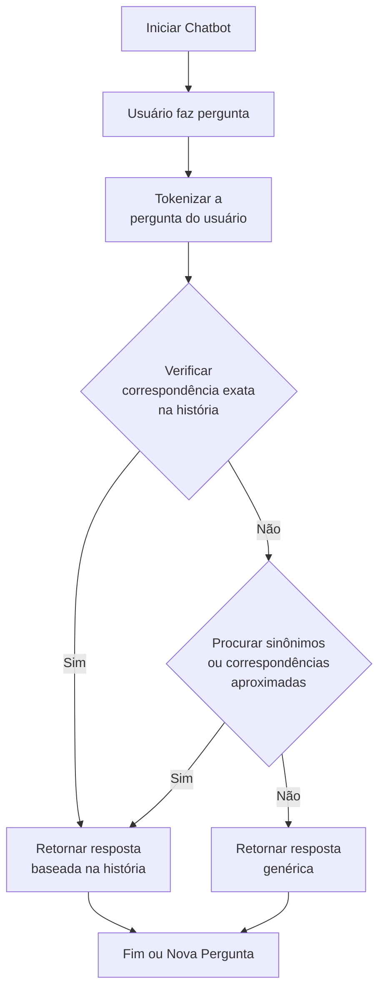

# Chatbot NLP - Explorador de Ecoturismo

Este projeto é um chatbot que responde a perguntas relacionadas à vida e às aventuras de João, um jovem aventureiro apaixonado por ecoturismo. O chatbot utiliza técnicas de processamento de linguagem natural (NLP) para interpretar as perguntas do usuário e encontrar respostas com base em um texto predefinido.

## Funcionalidades

- **Respostas baseadas em um texto predefinido**: O chatbot responde a perguntas sobre a história de João, explorando o texto e fornecendo respostas relevantes.
- **Correspondência semântica**: O chatbot usa uma combinação de tokenização e similaridade semântica para entender e mapear as perguntas do usuário.
- **Sinônimos em Português**: O chatbot utiliza o WordNet para encontrar sinônimos em português, aumentando a capacidade de interpretar perguntas diversificadas.
- **Tokenização de Palavras e Frases**: O texto é dividido em sentenças, e cada sentença é analisada em busca de respostas relevantes para as perguntas do usuário.

## Tecnologias Utilizadas

- **Python**: Linguagem principal utilizada para desenvolvimento do chatbot.
- **NLTK (Natural Language Toolkit)**: Utilizado para tokenização de palavras e sentenças, bem como para busca de sinônimos e correspondência de palavras semânticas.
- **WordNet**: Base de dados lexical utilizada para buscar sinônimos em português.

## Estrutura do Código

### 1. Texto da História
O chatbot trabalha com um texto predefinido que conta a história de João, suas aventuras, e suas atividades relacionadas ao ecoturismo e conservação ambiental. O texto está armazenado na variável `text` e é utilizado para encontrar respostas às perguntas dos usuários.

### 2. Funções Principais

#### a) `get_synonyms(word)`
Esta função busca sinônimos em português para uma determinada palavra utilizando o WordNet.

#### b) `semantic_similarity(user_input, keywords)`
Verifica se há similaridade semântica entre as palavras-chave e a entrada do usuário. Ele utiliza sinônimos e correspondências aproximadas para melhorar a interpretação do chatbot.

#### c) `find_detailed_answer(user_input)`
Procura uma sentença dentro do texto que melhor corresponda à entrada do usuário, calculando a quantidade de palavras comuns entre a pergunta e as sentenças do texto.

#### d) `answer_question(user_input)`
Esta função é o mapeamento de perguntas para respostas. Ela utiliza a função `find_detailed_answer` para encontrar a sentença mais relevante no texto e retornar uma resposta apropriada.

#### e) `chatbot()`
A função principal que inicializa o chatbot, capturando a entrada do usuário e respondendo com base nas perguntas feitas.

## Como Executar

1. Instale as dependências :
   ```python
   pip install -r requirements.txt
   ```
2. Rode o projeto no terminal:
    ```python
    python main.py
    ```

### Diagrama do chatbot:
